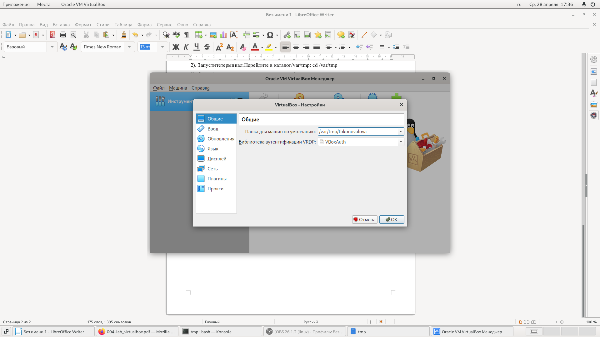
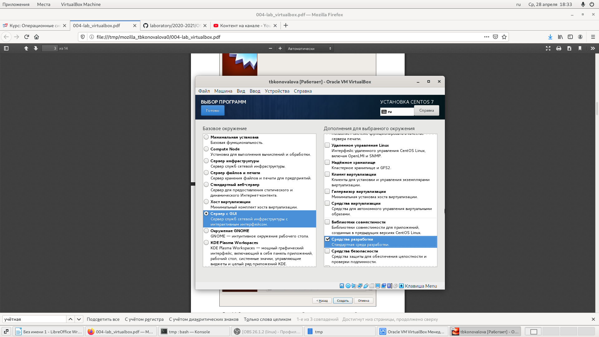
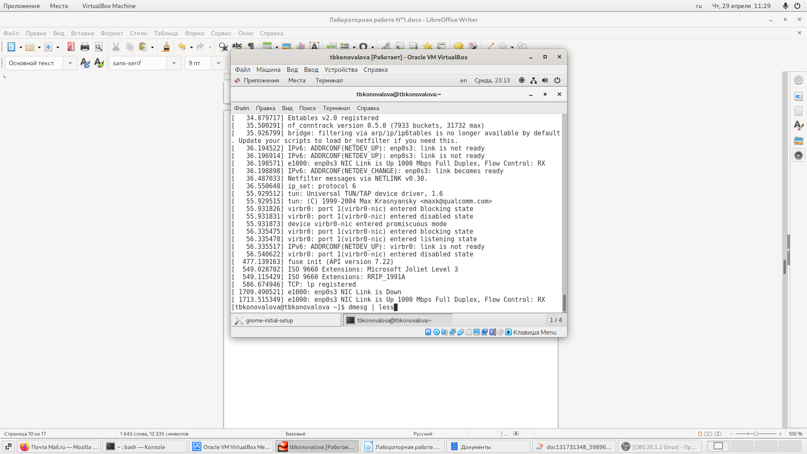
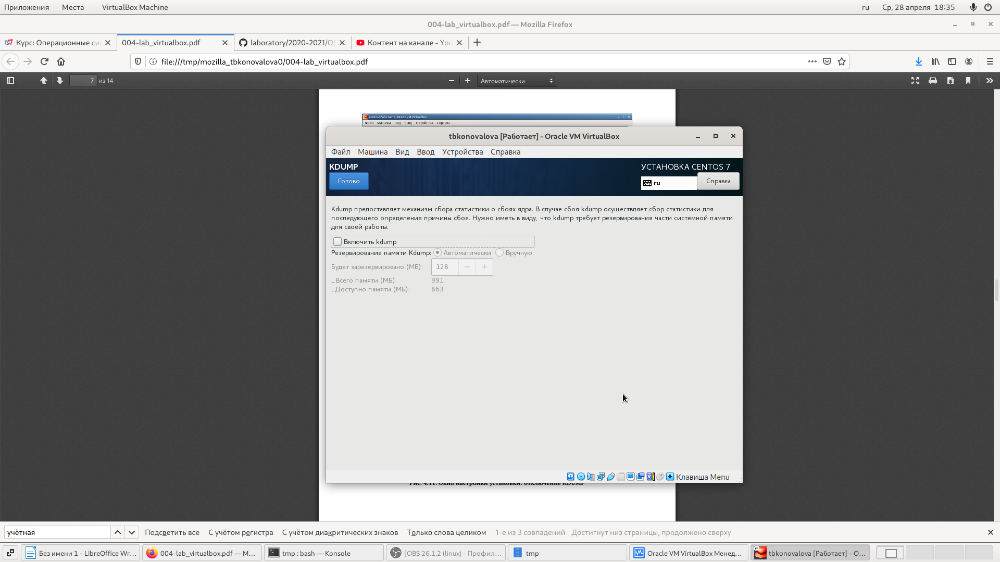
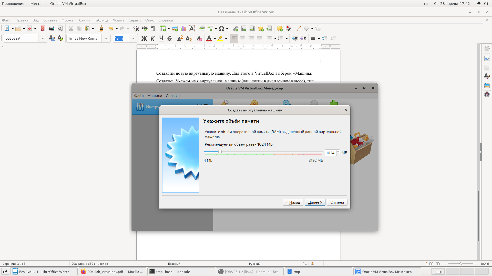
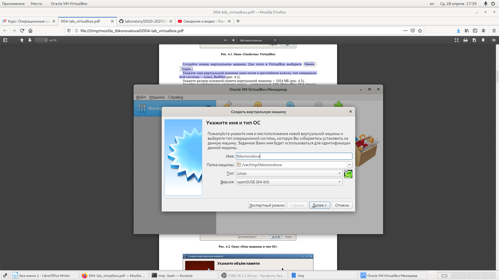

---
## Front matter
lang: ru-RU
title: Отчёт по лабораторной работе №3
author: Коновалова Татьяна Борисовна
institute: РУДН, Москва, Россия

date: 7 Сентября 2023

## Formatting
toc: false
slide_level: 2
theme: metropolis
header-includes: 
 - \metroset{progressbar=frametitle,sectionpage=progressbar,numbering=fraction}
 - '\makeatletter'
 - '\beamer@ignorenonframefalse'
 - '\makeatother'
aspectratio: 43
section-titles: true
---

# Отчет по лабораторной работы №1

## Установка виртуальной машины

- Установка пути для виртуальной машины, его имени и простейших настроек

{ #fig:007 width=70% }

## Запуск виртуальной машиной

{ #fig:009 width=70% }

## Работа с виртуальной машиной (Домашняя работа №1)

- На данном слайде представлено одно из заданий Домашней работы к лабораторной работе №1

{ #fig:006 width=70% }

## Работа с GitHub

{ #fig:005 width=70% }

## Основные команды git

- На следующем скриншоте представлены команды git, которые позволяют отправить созданные файлы в репозиторий на GitHub

{ #fig:008 width=70% }

## Работа с Markdown

{ #fig:001 width=70% }

## Выполнение лабораторной работы в Markdown

- На слеющий скриншотах представлен алгоритм выполнения лабораторной работы №1 в Markdown

{ #fig:003 width=70% }

## Выполнение лабораторной работы в Markdown

{ #fig:004 width=70% }

## Оформляем ход работы в Markdown

- Расписываем полностью алгоритм работы с прошлой лабораторной работы.

- Оформление скриншота в Markdown: обязательно указывать полную ссылку для каждого изображения (пример оформления ссылки представлен на скриншоте)

{ #fig:002 width=70% }

## Выводы

- Установила VirtualBox, изучила её работу. 
- Изучила идеологию и научилась пременять средства контроля версий. 
- Научилась работать с Markdown-файлами.
- Научилась создавать pdf и docx файлы из файла Markdown (с помощью команды make);

## {.standout}

Спасибо за внимание!
