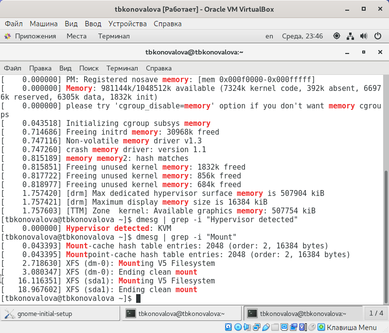

---
## Front matter
lang: ru-RU
title: Отчёт по лабораторной работе №1
author: Коновалова Татьяна Борисовна
institute: РУДН, Москва, Россия

date: 7 Сентября 2023

## Formatting
toc: false
slide_level: 2
theme: metropolis
header-includes: 
 - \metroset{progressbar=frametitle,sectionpage=progressbar,numbering=fraction}
 - '\makeatletter'
 - '\beamer@ignorenonframefalse'
 - '\makeatother'
aspectratio: 43
section-titles: true
---

# Отчет по лабораторной работы №1

## Установка VirtualBox

Запуск программы и создание пользователя 
{ #fig:001 width=70% }
{ #fig:002 width=70% }

## Общие настройки VirtualBox

- Укажием имя виртуальной машины (ваш логин в дисплейном классе), тип
операционной системы — Linux, RedHat
- Укажем размер основной памяти виртуальной машины—1024 МБ

{ #fig:004 width=70% }
{ #fig:003 width=70% }

## Настройки операционной системы в VirtualBox

- На слеющий скриншотах представлен алгоритм установки ОС в VirtualBox

{ #fig:007 width=70% }
{ #fig:008 width=70% }

## Выполнение домашней работы

- С помощью VirtualBox запускаем консоль и последовательно выполняем действия, описанные в лабораторной работе №1

{ #fig:005 width=70% }
{ #fig:006 width=70% }

## Выводы

Приобрела практические навыки установки операционной системы на
виртуальную машину, настройки минимально необходимых для дальнейшей работы
сервисов

## {.standout}

Спасибо за внимание!
