---
# Front matter
lang: ru-RU
title: "Лабораторная работа №3"
subtitle: "Дисциплина: Операционные системы"
author: "Коновалова Татьяна Борисовна"

# Formatting
toc-title: "Содержание"
toc: true # Table of contents
toc_depth: 2
lof: true # List of figures
lot: true # List of tables
fontsize: 12pt
linestretch: 1.5
papersize: a4paper
documentclass: scrreprt
polyglossia-lang: russian
polyglossia-otherlangs: english
mainfont: PT Serif
romanfont: PT Serif
sansfont: PT Sans
monofont: PT Mono
mainfontoptions: Ligatures=TeX
romanfontoptions: Ligatures=TeX
sansfontoptions: Ligatures=TeX,Scale=MatchLowercase
monofontoptions: Scale=MatchLowercase
indent: true
pdf-engine: lualatex
header-includes:
  - \linepenalty=10 # the penalty added to the badness of each line within a paragraph (no associated penalty node) Increasing the value makes tex try to have fewer lines in the paragraph.
  - \interlinepenalty=0 # value of the penalty (node) added after each line of a paragraph.
  - \hyphenpenalty=50 # the penalty for line breaking at an automatically inserted hyphen
  - \exhyphenpenalty=50 # the penalty for line breaking at an explicit hyphen
  - \binoppenalty=700 # the penalty for breaking a line at a binary operator
  - \relpenalty=500 # the penalty for breaking a line at a relation
  - \clubpenalty=150 # extra penalty for breaking after first line of a paragraph
  - \widowpenalty=150 # extra penalty for breaking before last line of a paragraph
  - \displaywidowpenalty=50 # extra penalty for breaking before last line before a display math
  - \brokenpenalty=100 # extra penalty for page breaking after a hyphenated line
  - \predisplaypenalty=10000 # penalty for breaking before a display
  - \postdisplaypenalty=0 # penalty for breaking after a display
  - \floatingpenalty = 20000 # penalty for splitting an insertion (can only be split footnote in standard LaTeX)
  - \raggedbottom # or \flushbottom
  - \usepackage{float} # keep figures where there are in the text
  - \floatplacement{figure}{H} # keep figures where there are in the text
---

# Цель работы

Цель данной лабораторной работы --- Научиться оформлять отчёты с помощью легковесного языка разметки Markdown.

# Задание

1.Сделайте отчёт по предыдущей лабораторной работе в формате Markdown.
2.В качестве отчёта предоставить отчёты в 3 форматах: pdf,docx и md

# Выполнение лабораторной работы

1). Создаем учетную запись на https://github.com. (иллюстрация на рис. 1)

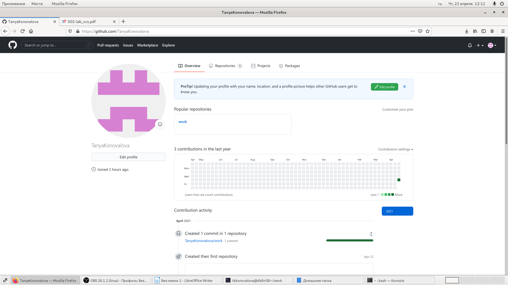{ #fig:001 width=70% }

2). Настраиваем систему контроля версий git. Синхранизируем учётную запись github с компьютером:
git config --global user.name"Имя Фамилия"
git config --global user.email"work@mail"
После этого создаём новый ключ на github (команда ssh-keygen -C"TanyaKonovalova <tanya.konovalova.02@mail>") и привязываем его к копьютеру через консоль (алгоритм действий представлен на рис.2).

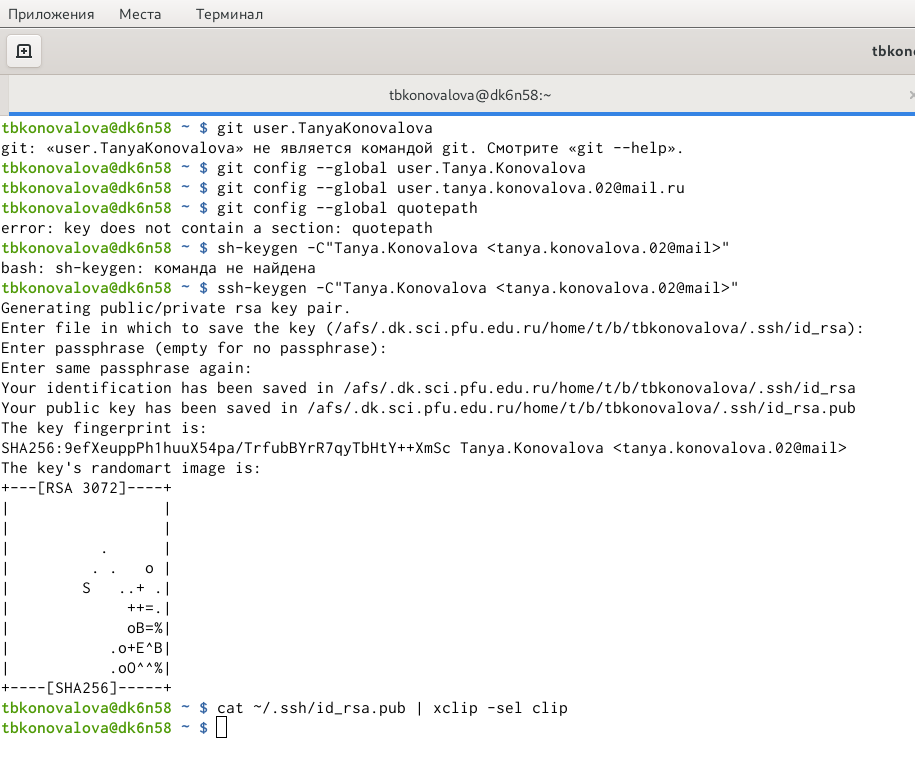{ #fig:002 width=70% }

3). Следующим шагом будет создание и подключение репозитория к github. В gethup заходим в «repository» и создаём новый репозиторий (имя «laboratory», а зоголовок для файла README) (иллюстрация представлена на рис. 3.1, 3.2). 
Копируем в консоль ссылку на репозиторий (для дальнейшей работы с файлами) (алгоритм действий см. на рис.3.3):

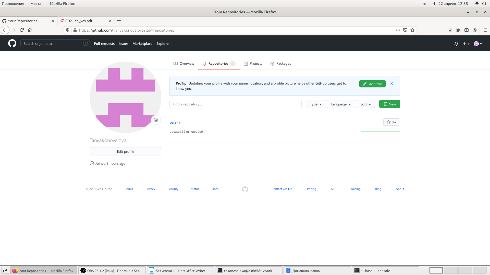{ #fig:03.1 width=70% }
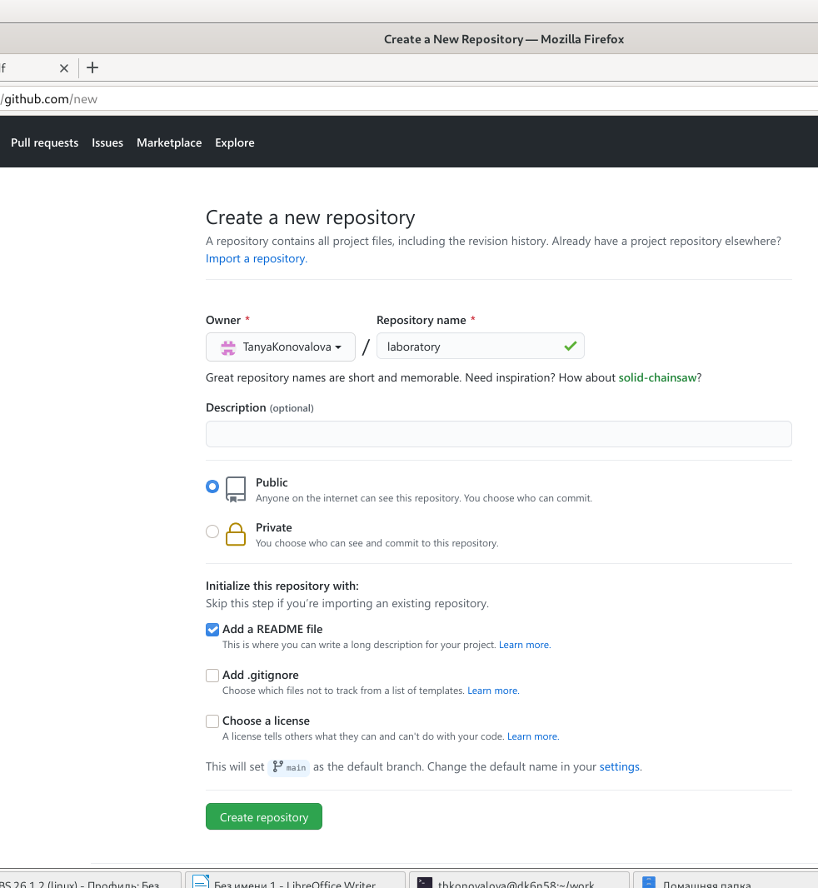{ #fig:03.2 width=70% }
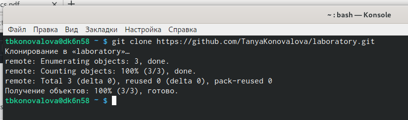{ #fig:03.3 width=70% }

4). В лабораторной работе описан логаритм создания структуры католога через консоль. Но легче будет создать репозиторий в gethup и после этого работать с каталогом и папками через консоль (перед этим необходимо скопировать ссылку на репозиторий в консоль, в формате https или ssh).
Перед тем, как создавать файлы, заходим в наш репозиорий (алгоритм действий представлен на рис. 4.1):

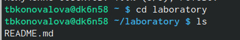{ #fig:04.1 width=70% }

После этого можем уже создавать наши файлы:

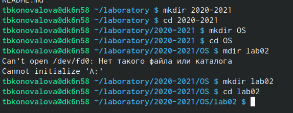{ #fig:04.2 width=70% }

5). Добавляем первый коммит и выкладываем на gethup. Для того, чтобы правильно разместить первый коммит, необходимо добавить команду git add ., после этого с помощью команды git commit -am "first commit" выкладываем коммит:

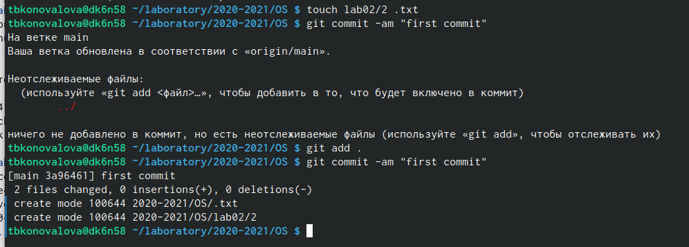{ #fig:005 width=70% }

6). Сохраняем первый коммит, используя команду git push:

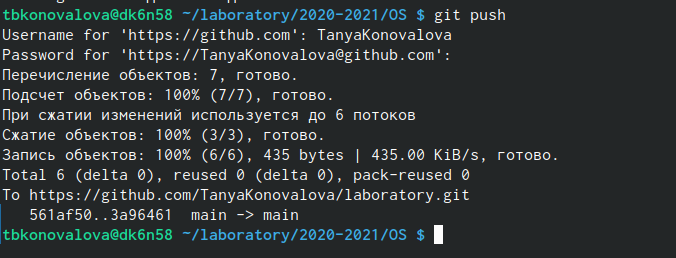{ #fig:006 width=70% }

7). Первичная конфигурация (Пояснения к каждому действию алгоритма представлены на рис. 71-74):
a. Добавляем файл лицензии;

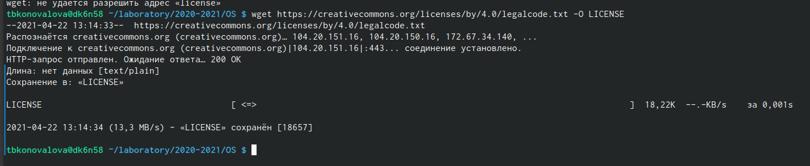{ #fig:071 width=70% }

b. Добавим шаблон игнорируемых файлов.Просмотрим список имеющихся шаблонов (на скриншоте список шаблонов представлен не в целом виде):

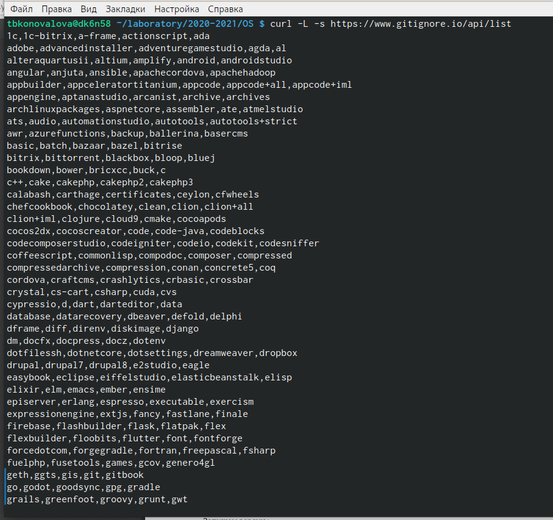{ #fig:072 width=70% }

c. Скачиваем щаблон, например, для C. Также добавляем новые файлы и выполняем коммит:

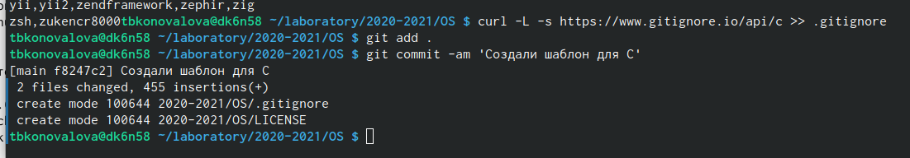{ #fig:073 width=70% }

d. Отправим на github (для этого сохраним все созданные шаблоны и файлы, используя команду git push):

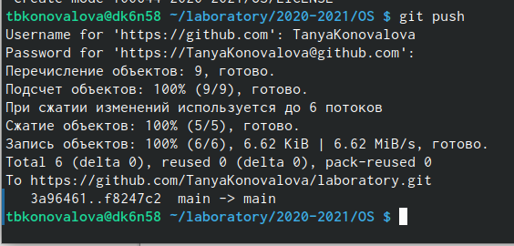{ #fig:074 width=70% }

8). Работаем с конфигурацией git-flow (алгоритм к каждому действию представлен на рис. 81-87):
a. Инициализируем git-flow, используя команду git flow init -f (префикс для ярлыков установлен в v):

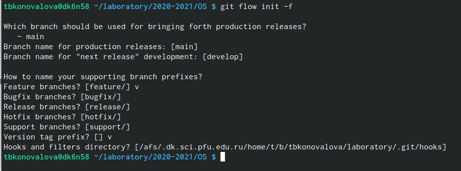{ #fig:081 width=70% }

b. Проверяем, что мы находимся на ветке develop (используем команду git branch):

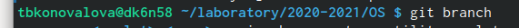{ #fig:082 width=70% }
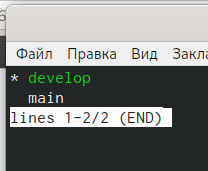{ #fig:083 width=70% }

c. Создаём релиз с версией 1.0.0:

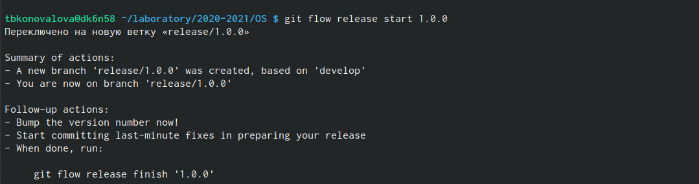{ #fig:084 width=70% }

d. Запишем версию и добавим в индекс:
  echo'hello world'> hello.txt
  git add hello.txt
  git commit -am'Новый файл

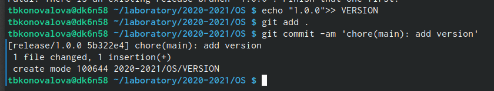{ #fig:085 width=70% }

e. Заливаем релизную ветку в основную ветку (используем команду git flow release finish1.0.0):

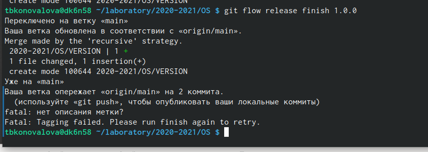{ #fig:086 width=70% }

f. Отправляем данные на github:
  git push - -all
  git push - -tags

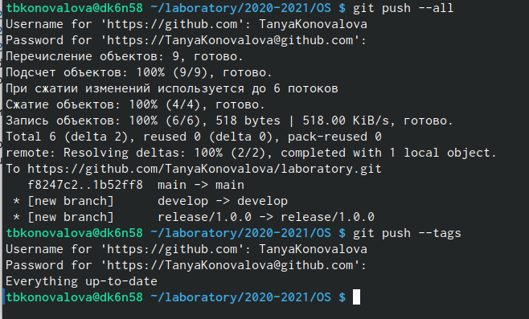{ #fig:087 width=70% }

9). Создаем релиз на github. Для этого заходим в «Releases», нажимаем «Создать новый релиз». Заходим в теги и заполняем все поля (создаём теги для версии 1.0.0). После создания тега, автоматически сформируется релиз (подробное изложение действий представлено на рис. 91-93).

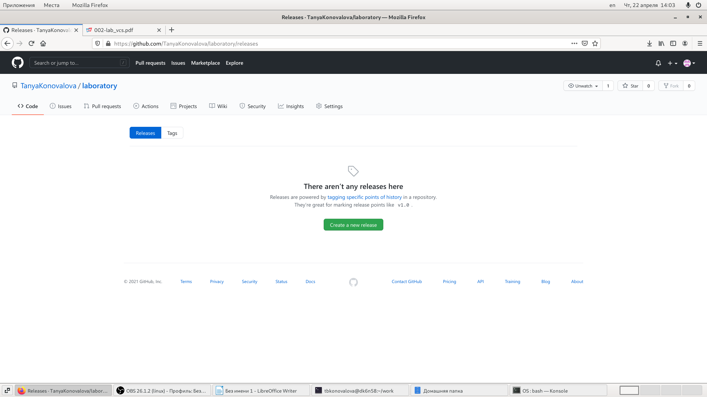{ #fig:091 width=70% }
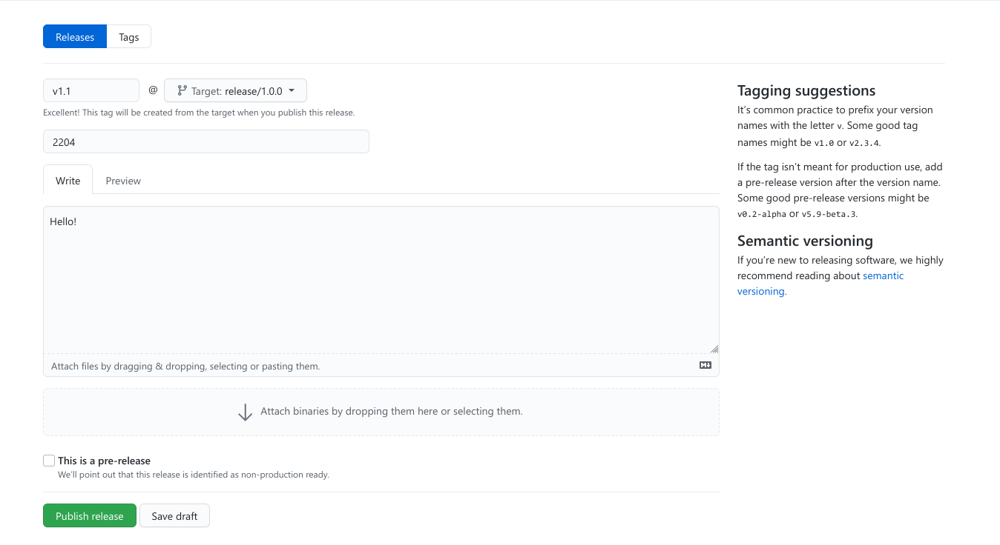{ #fig:092 width=70% }
{ #fig:093 width=70% }

# Выводы

Изучила идеологию и научилась пременять средства контроля версий.
