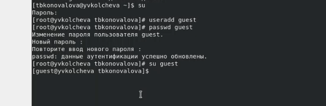
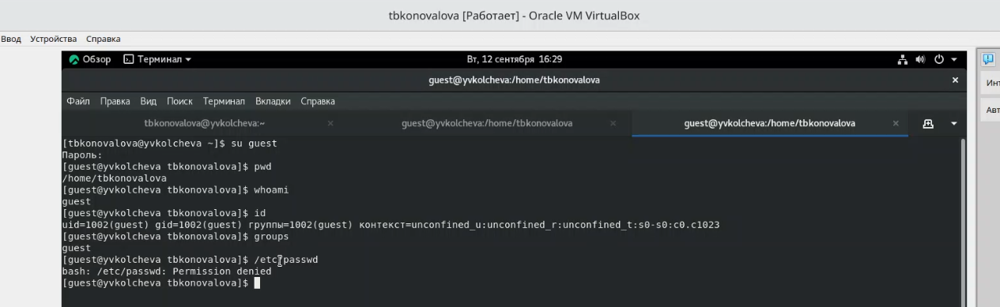
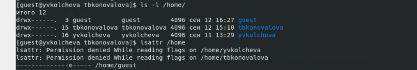
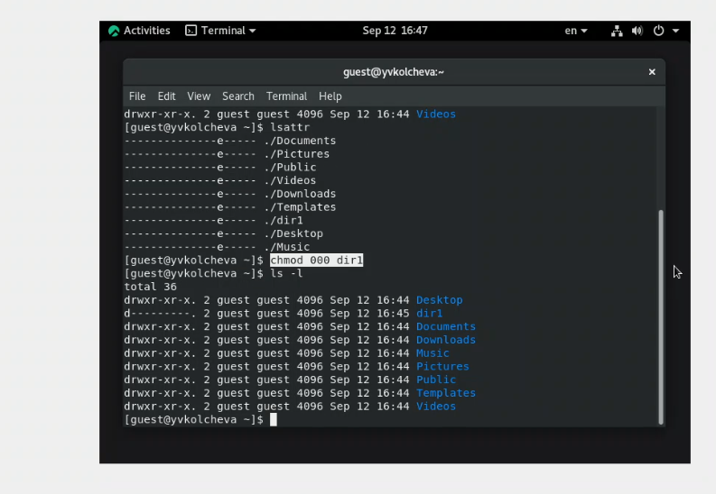
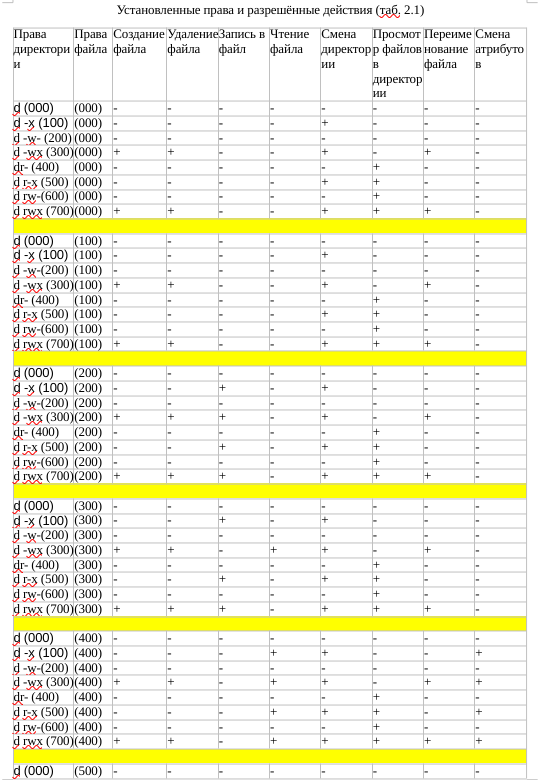
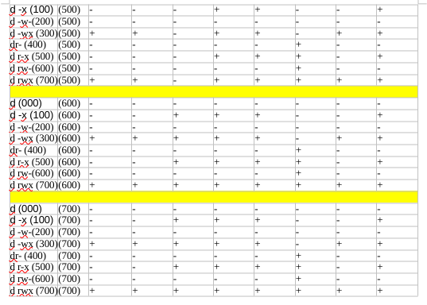

---
## Front matter
lang: ru-RU
title: Презентация по лабораторной работе №2
author: Коновалова Татьяна Борисовна
institute: РУДН, Москва, Россия

date: 12 Сентября 2023

## Formatting
toc: false
slide_level: 2
theme: metropolis
header-includes: 
 - \metroset{progressbar=frametitle,sectionpage=progressbar,numbering=fraction}
 - '\makeatletter'
 - '\beamer@ignorenonframefalse'
 - '\makeatother'
aspectratio: 43
section-titles: true
polyglossia-lang: russian
polyglossia-otherlangs: english
mainfont: PT Serif
romanfont: PT Serif
sansfont: PT Sans
monofont: PT Mono
mainfontoptions: Ligatures=TeX
romanfontoptions: Ligatures=TeX
sansfontoptions: Ligatures=TeX,Scale=MatchLowercase
monofontoptions: Scale=MatchLowercase
---

# Презентация по лабораторной работы №2

## Цель лабораторной работы №2

Цель: Получить практические навыки работы в консоли с атрибутами файлов, закрепить теоретические основы дискреционного разграничения доступа в современных системах с открытым кодом на базе ОС Linux.

# Ход выполнения лабораторной работы

## Создание нового пользователя в виртуальной машине

Создала нового пользователя guest командой useradd, затем устанавила для него пароль с помощью команды passwd guest

{ #fig:001 width=70% }

## Проверка данных пользователя

 C помощью команды id узнала uid пользователя и группы, в которых он состоит

{ #fig:005 width=70% }

## Просмотр атрибутов

С помощью команды ls рассмотрела атрибуты. 
С помощью команды lsattr рассмотрела расширенные атрибуты текущего пользователя 

{ #fig:010 width=70% }

## Смена прав доступа

Поменяла директории dir1 атрибуты с помощью команды chmod 000

{ #fig:01 width=70% }

## Разрешённые действия

Изучая все атрибуты, я составила таблицу «Установленные права и разрешённые действия»

{ #fig:013 width=70% }

## Разрешённые действия

{ #fig:014 width=70% }

## Минимальные требования

На основании этой таблицы я заполнила вторую «Минимальные права для совершения операций». В данной таблице указала минимальные требования на права и директорию для выполнения тех или иных действий. Все данные я внесла в таблицу

{ #fig:015 width=70% }

## Выводы

- Получила практические навыки работы в консоли с атрибутами файлов;
- Закрепила теоретические основы дискреционного разграничения доступа в современных системах с открытым кодом на базе ОС Linux.

## Библиография

СПИСОК ЛИТЕРАТУРЫ

1.Медведовский И.Д., Семьянов П.В., Платонов В.В. Атака через Internet. — НПО "Мир и семья-95",  1997. — URL: http://bugtraq.ru/library/books/attack1/index.html

2.Теоеретические знания, приведённые в Лабораторной работе №2 - https://esystem.rudn.ru/pluginfile.php/2090123/mod_resource/content/6/002-lab_discret_attr.pdf

3.Запечников С. В. и др. Информационн~пасность открытых систем. Том 1. — М.: Горячаая линия -Телеком, 2006.

СПИСОК ИНТЕРНЕТ-ИСТОЧНИКОВ

1.[Электронный ресурс] - доступ: https://codeby.school/blog/informacionnaya-bezopasnost/razgranichenie-dostupa-v-linux-znakomstvo-s-astra-linux

2.[Электронный ресурс] - доступ: https://debianinstall.ru/diskretsionnoe-razgranichenie-dostupa-linux/

## {.standout}

Спасибо за внимание!
