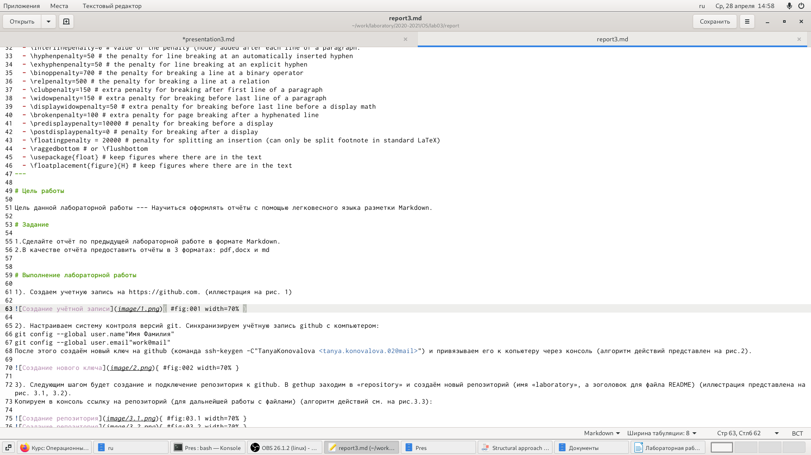
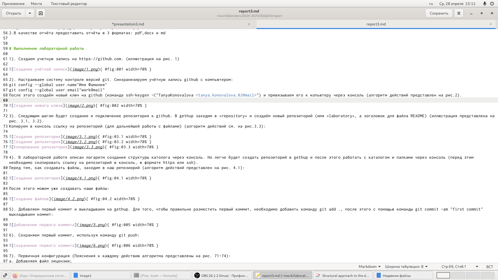
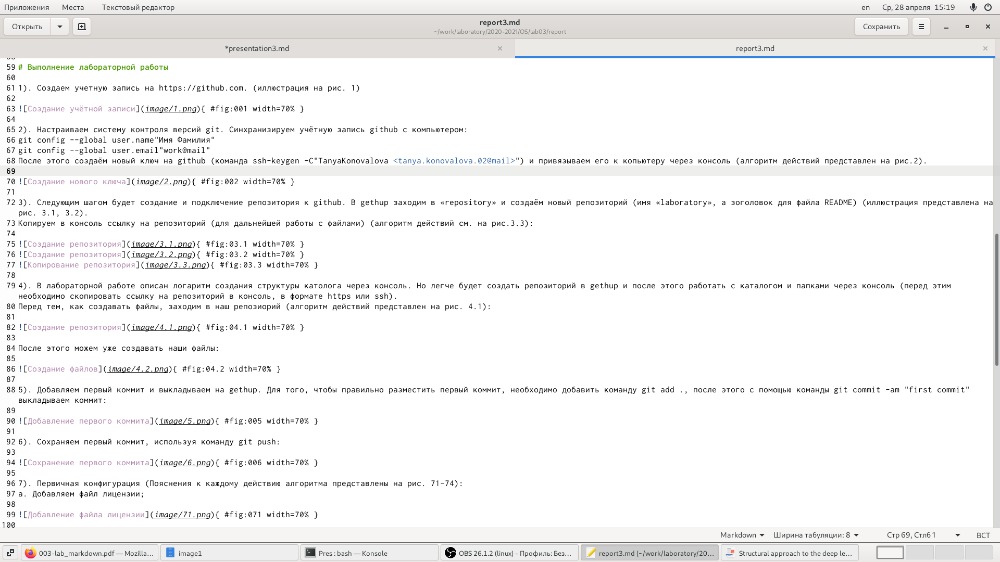
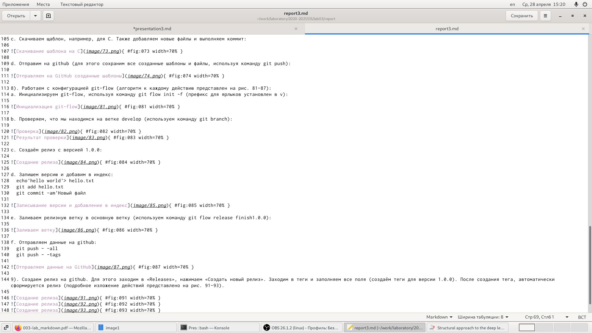
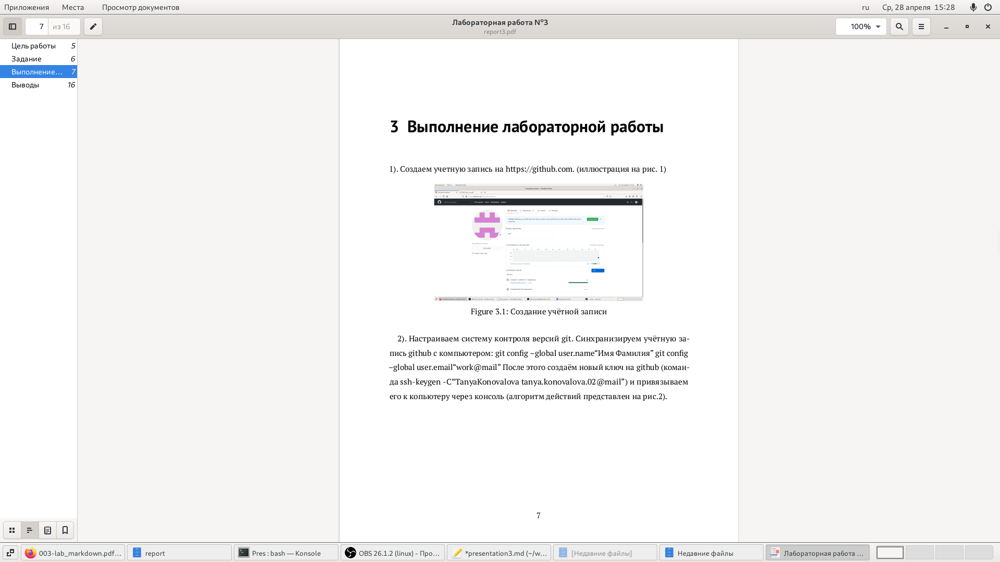

---
## Front matter
lang: ru-RU
title: Отчёт по лабораторной работе №3
author: Коновалова Татьяна Борисовна
institute: РУДН, Москва, Россия

date: 28 Апреля 2021

## Formatting
toc: false
slide_level: 2
theme: metropolis
header-includes: 
 - \metroset{progressbar=frametitle,sectionpage=progressbar,numbering=fraction}
 - '\makeatletter'
 - '\beamer@ignorenonframefalse'
 - '\makeatother'
aspectratio: 43
section-titles: true
---

# Отчет по лабораторной работы №3

## Работа с Markdown

{ #fig:001 width=70% }

- Так как данная лабораторная работа строится на Лабораторной работе №2, мы копируем основные моменты с прошлого отчёта

## Оформляем ход работы

- Расписываем полностью алгоритм работы с прошлой лабораторной работы.

- Оформление скриншота в Markdown: обязательно указывать полную ссылку для каждого изображения (пример оформления ссылки представлен на скриншоте)

{ #fig:002 width=70% }

## Выполнение лабораторной работы

- На слеющий скриншотах представлен алгоритм выполнения лабораторной работы №2 в Markdown

{ #fig:002 width=70% }
{ #fig:002 width=70% }

## Создание отчета в трёх форматах

С помощью команды make мы можем дополнительно создать два файла в формате pdf и docx. На слеющий скриншотах представлены отчеты лабораторной работы №2 в разных форматах

{ #fig:002 width=70% }
{ #fig:002 width=70% }

## Выводы

- научилась работать с Markdown;
- научилась создавать pdf и docx файлы из файла Markdown (с помощью команды make);
- сделала отчёт по предыдущей лабораторной работе в формате Markdown;

## {.standout}

Спасибо за внимание!
