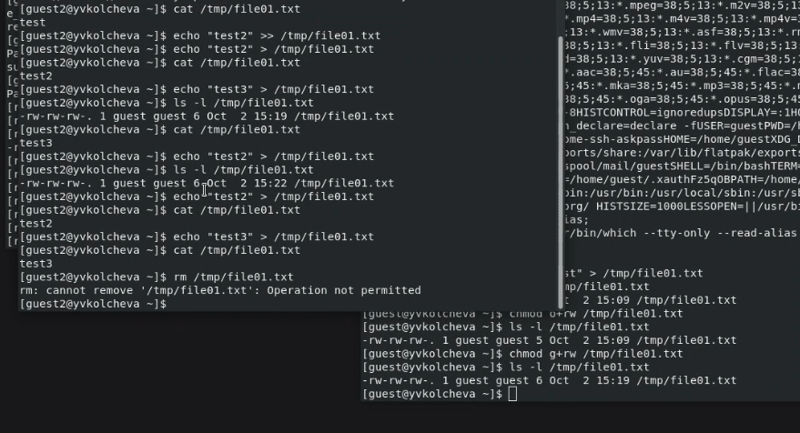
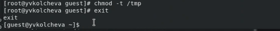

---
## Front matter
lang: ru-RU
title: Презентация по лабораторной работе №5
author: Коновалова Татьяна Борисовна
institute: РУДН, Москва, Россия

date: 2 Октября 2023

## Formatting
toc: false
slide_level: 2
theme: metropolis
header-includes: 
 - \metroset{progressbar=frametitle,sectionpage=progressbar,numbering=fraction}
 - '\makeatletter'
 - '\beamer@ignorenonframefalse'
 - '\makeatother'
aspectratio: 43
section-titles: true
polyglossia-lang: russian
polyglossia-otherlangs: english
mainfont: PT Serif
romanfont: PT Serif
sansfont: PT Sans
monofont: PT Mono
mainfontoptions: Ligatures=TeX
romanfontoptions: Ligatures=TeX
sansfontoptions: Ligatures=TeX,Scale=MatchLowercase
monofontoptions: Scale=MatchLowercase
indent: true
pdf-engine: xelatex
header-includes:
  - \linepenalty=10 # the penalty added to the badness of each line within a paragraph (no associated penalty node) Increasing the value makes tex try to have fewer lines in the paragraph.
  - \interlinepenalty=0 # value of the penalty (node) added after each line of a paragraph.
  - \hyphenpenalty=50 # the penalty for line breaking at an automatically inserted hyphen
  - \exhyphenpenalty=50 # the penalty for line breaking at an explicit hyphen
  - \binoppenalty=700 # the penalty for breaking a line at a binary operator
  - \relpenalty=500 # the penalty for breaking a line at a relation
  - \clubpenalty=150 # extra penalty for breaking after first line of a paragraph
  - \widowpenalty=150 # extra penalty for breaking before last line of a paragraph
  - \displaywidowpenalty=50 # extra penalty for breaking before last line before a display math
  - \brokenpenalty=100 # extra penalty for page breaking after a hyphenated line
  - \predisplaypenalty=10000 # penalty for breaking before a display
  - \postdisplaypenalty=0 # penalty for breaking after a display
  - \floatingpenalty = 20000 # penalty for splitting an insertion (can only be split footnote in standard LaTeX)
  - \raggedbottom # or \flushbottom
  - \usepackage{float} # keep figures where there are in the text
  - \floatplacement{figure}{H} # keep figures where there are in the text
---

# Презентация по лабораторной работы №5

## Цель лабораторной работы №5

Цель: Изучить механизмы изменения идентификаторов, применения SetUID- и Sticky-битов. Получить практические навыки работы в консоли с дополнительными атрибутами. Рассмотреть работы механизма смены идентификатора процессов пользователей, а также влияние бита Sticky на запись и удаление файлов.

## Задачи лабораторной работы №5

- Создать программу, выводящую uid и gid, и посмотреть на вывод после добавления SetUID и SetGID битов.
- Создать программу для чтения файлов и проверить вывод после добавления SetUID бита.
- На примере папки /tmp изучить влияние Sticky бита на запись и удаление файлов.

# Ход выполнения лабораторной работы

## Создание файла

Создала программу simpleid.c со следующим текстом 

{ #fig:005 width=70% }

## Работа с созданной программой

Скомпилировала программу с помощью команды gcc и убедилась, что файл действительно создан. 
Далее запустила исполняемый файл через ./. 
Вывод написанной программы совпадает с выводом команды id 

{ #fig:006 width=70% }

## Установка SetUID-бит

От имени суперпользователя сменила владельца файла simpleid2 на root и установила SetUID-бит. 
После этого через команду ls -l убедилась, что бит установился корректно 

{ #fig:010 width=70% }

## Работа с программой readfile.c

Создала программу readfile.c 

{ #fig:013 width=70% }

## Наличие Sticky-бита

Проводим над файлом file01.txt следующие действия: читаем его, дозаписываем и перезаписываем информацию, переименовываем. Эти действия проходят без ошибок. При попытке удаления возникает ошибка.

{ #fig:020 width=70% }

## Изменение Sticky-бита

От имени суперпользователя удаляем sticku-бит командой chmod -t.

{ #fig:021 width=70% }

## Отсутствие Sticky-бита

Повторяем описанные ранее действия над файлом file01.txt. Теперь пользователь может удалить не принадлежащий ему файл.

{ #fig:022 width=70% }

## Выводы

Изучила механизмы изменения идентификаторов, применения SetUID- и Sticky-битов. Получила практические навыки работы в консоли с дополнительными атрибутами. Рассмотрела работы механизма смены идентификатора процессов пользователей, а также влияние бита Sticky на запись и удаление файлов.

## Библиография

СПИСОК ЛИТЕРАТУРЫ

1.Медведовский И.Д., Семьянов П.В., Платонов В.В. Атака через Internet. — НПО "Мир и семья-95",  1997. — URL: http://bugtraq.ru/library/books/attack1/index.html

2.Теоеретические знания, приведённые в Лабораторной работе №5 - https://esystem.rudn.ru/pluginfile.php/2090129/mod_resource/content/2/005-lab_discret_sticky.pdf

СПИСОК ИНТЕРНЕТ-ИСТОЧНИКОВ

1.[Электронный ресурс] - доступ: https://codeby.school/blog/informacionnaya-bezopasnost/razgranichenie-dostupa-v-linux-znakomstvo-s-astra-linux

## {.standout}

Спасибо за внимание!
