---
# Front matter
lang: ru-RU
title: "Лабораторная работа №5"
subtitle: "Дисциплина: Основы информационной безопасности"
author: "Коновалова Татьяна Борисовна"

# Formatting
toc-title: "Содержание"
toc: true # Table of contents
toc_depth: 2
lof: true # List of figures
lot: true # List of tables
fontsize: 12pt
linestretch: 1.5
papersize: a4paper
documentclass: scrreprt
polyglossia-lang: russian
polyglossia-otherlangs: english
mainfont: PT Serif
romanfont: PT Serif
sansfont: PT Sans
monofont: PT Mono
mainfontoptions: Ligatures=TeX
romanfontoptions: Ligatures=TeX
sansfontoptions: Ligatures=TeX,Scale=MatchLowercase
monofontoptions: Scale=MatchLowercase
indent: true
pdf-engine: xelatex
header-includes:
  - \linepenalty=10 # the penalty added to the badness of each line within a paragraph (no associated penalty node) Increasing the value makes tex try to have fewer lines in the paragraph.
  - \interlinepenalty=0 # value of the penalty (node) added after each line of a paragraph.
  - \hyphenpenalty=50 # the penalty for line breaking at an automatically inserted hyphen
  - \exhyphenpenalty=50 # the penalty for line breaking at an explicit hyphen
  - \binoppenalty=700 # the penalty for breaking a line at a binary operator
  - \relpenalty=500 # the penalty for breaking a line at a relation
  - \clubpenalty=150 # extra penalty for breaking after first line of a paragraph
  - \widowpenalty=150 # extra penalty for breaking before last line of a paragraph
  - \displaywidowpenalty=50 # extra penalty for breaking before last line before a display math
  - \brokenpenalty=100 # extra penalty for page breaking after a hyphenated line
  - \predisplaypenalty=10000 # penalty for breaking before a display
  - \postdisplaypenalty=0 # penalty for breaking after a display
  - \floatingpenalty = 20000 # penalty for splitting an insertion (can only be split footnote in standard LaTeX)
  - \raggedbottom # or \flushbottom
  - \usepackage{float} # keep figures where there are in the text
  - \floatplacement{figure}{H} # keep figures where there are in the text
---

# Цель работы

Цель лабораторной работы --- Изучить механизмы изменения идентификаторов, применения SetUID- и Sticky-битов. Получить практические навыки работы в консоли с дополнительными атрибутами. Рассмотреть работы механизма смены идентификатора процессов пользователей, а также влияние бита Sticky на запись и удаление файлов.

# Теоретические данные

Типы разрешений:

SetUID, SetGID и Sticku --- это специальные типы разрешений, которые позволяют задавать расширенные права доступа на файлы и каталоги.

- SetUID --- это бит разрешения, который позволяет пользователю запускать исполняемый файл с правами владельца этого файла. Другими словами, использование этого бита позволят поднять привилегии пользователя в случае, если это необходимо. Наличие SetUID бита выражается в том, что на месте классического бита x выставлен специальный бит s: -rwsr-xr-x
- SetGID --- очень похож на SetUID с отличием, что файл будет запускаться от имени группы, который владеет файлом: -rwxr-sr-x
- Sticky --- в случае, если этот бит установлен для папки, то файлы в этой папке могут быть удалены только их владельцем. Наличие этого бита показывается через букву t в конце всех прав: drwxrwxrwxt

Атрибуты --- это набор основных девяти битов, определяющих какие из пользователей обладают правами на чтение, запись
и исполнение. 
Первые три бита отвечают права доступа владельца, вторые --- для группы пользователей, последние --- для всех остальных
пользователей в системе.

Установка атрибутов производится командой chmod. Установка бита чтения (r) позволяет сделать файл доступным для чтения. 
Наличие бита записи (w) позволяет изменять файл. Установка бита запуска (x) позволяет запускать файл на исполнение.

Расширенные атрибуты --- это система дополнительной информации, которая может быть добавлена к файлу или директории в файловой системе.

Некоторые примеры расширенных атрибутов:

- а --- файл можно открыть только в режиме добавления.
- А --- при доступе к файлу его запись atime не изменяется.
- с --- файл автоматически сжимается.
- e --- файл использует экстенты.
- E --- файл, каталог или символьная ссылка зашифрованы файловой системой.
- F --- поиски путей в директории выполняются без учёта регистра.
- i --- файл не может быть изменён.
- m --- файл не сжимается.

Установка атрибутов производится командой chmod. Установка бита чтения (r) позволяет сделать файл доступным для чтения. 
Наличие бита записи (w) позволяет изменять файл. Установка бита запуска (x) позволяет запускать файл на исполнение.

# Задание

1.Создание и работа с программой simpleid.c ;
2.Исследование Sticky-бита.

# Выполнение лабораторной работы

## Создание программы

1). Убедлась, то компилятор gcc установлен, используя команду “gcc -v”. Затем отключила систему запретов до очередной перезагрузки системы командой “sudo setenforce 0”, после чего команда “getenforce” вывела “Permissive” (рис. [-@fig:001]) и (рис. [-@fig:002]).

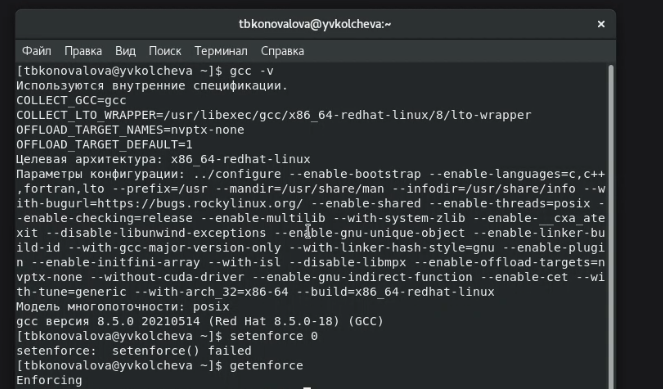{ #fig:001 width=70% }

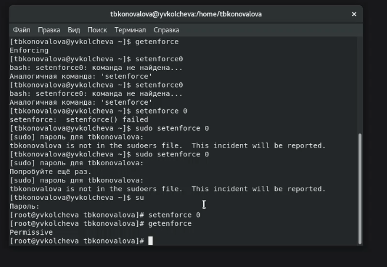{ #fig:002 width=70% }

Проверила успешное выполнение команд “whereis gcc” и “whereis g++” (их расположение) (рис. [-@fig:003]).

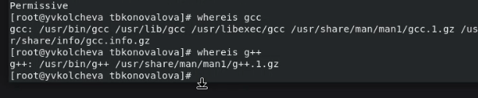{ #fig:003 width=70% }

2). Вошла в систему от имени пользователя guest командой “su - guest”. Создала программу simpleid.c командой “touch simpleid.c” и открыла её в редакторе командой “gedit /home/guest/simpleid.c” (рис. [-@fig:004]).

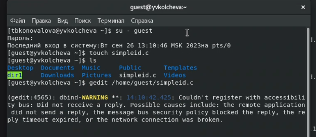{ #fig:004 width=70% }

Создала программу simpleid.c со следующим текстом (рис. [-@fig:005]).

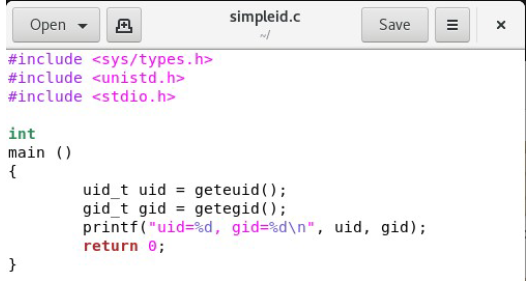{ #fig:005 width=70% }

3). Скомпилировала программу с помощью команды gcc и убедилась, что файл действительно создан. 
Далее запустила исполняемый файл через ./. 
Вывод написанной программы совпадает с выводом команды id (рис [-@fig:006]).

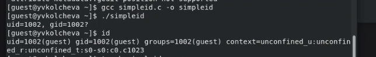{ #fig:006 width=70% }

4). Создание файла для программы simpleid2.c и запуск данного файла для ввода программы (рис. [-@fig:007]).

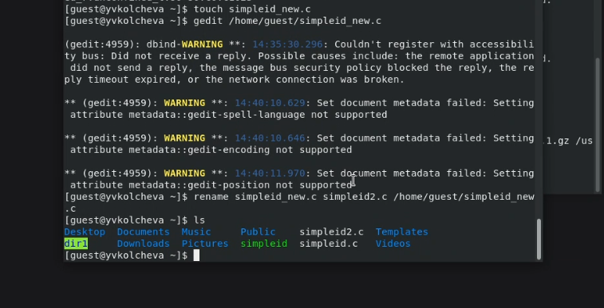{ #fig:007 width=70% }

Текст усложнённой программы, назвала её simpleid2.c (рис. [-@fig:008]).

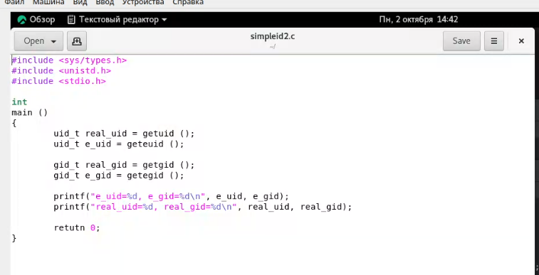{ #fig:008 width=70% }

Скомпилировала вторую программу с помощью команды gcc и убедилась, что файл действительно создан. 
Далее запустила исполняемый файл через ./. 
Вывод написанной программы совпадает с выводом команды id (рис [-@fig:009]).

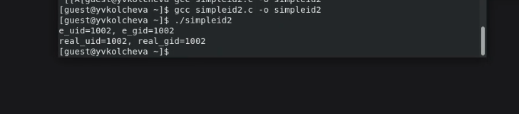{ #fig:009 width=70% }

5). От имени суперпользователя сменила владельца файла simpleid2 на root и установила SetUID-бит. 
После этого через команду ls -l убедилась, что бит установился корректно (рис. [-@fig:010])

{ #fig:010 width=70% }

6). Запустила программу simpleid2 и комаду id. Теперь вижу, что появились отличия в uid строках (рис. [-@fig:011]).

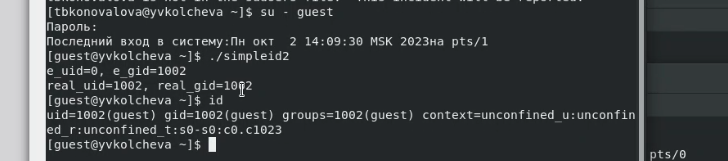{ #fig:011 width=70% }

Проделала выше описанные действия для SetGID-бита. Теперь после запуска simpleid2 увидела отличие и в gid строках (рис. [-@fig:012]).

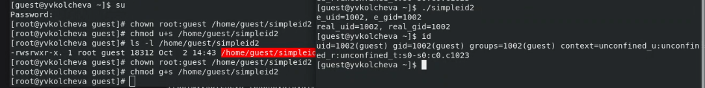{ #fig:012 width=70% }

8). Создала программу readfile.c (рис. [-@fig:013]).

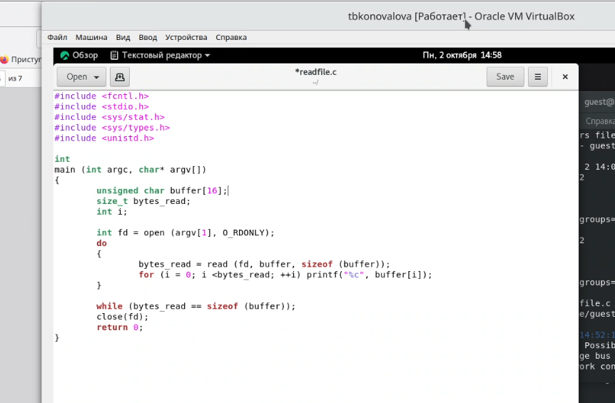{ #fig:013 width=70% }

Откомпилировала эту программу командой gcc .
После этого изменила владельца файла readfile.c и убрала у пользователя guest право на чтение. При попытке прочитать файл от имени пользователя guest теперь возникает ошибка (рис. [-@fig:014]) и (рис. [-@fig:015]).

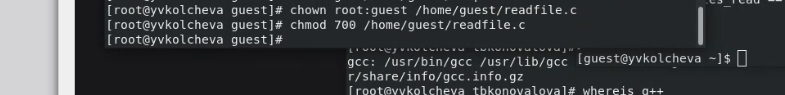{ #fig:014 width=70% }

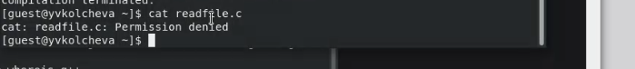{ #fig:015 width=70% }

10). Поменяла владельца файла readfile и установила на него SetUID-бит (рис. [-@fig:016]).
Запустила исполняемый файл и убедилась, что программа может прочитать файлы readfile.c и /etc/shadow (рис. [-@fig:017]) и (рис. [-@fig:018]).

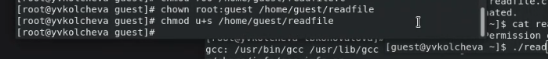{ #fig:010 width=70% }

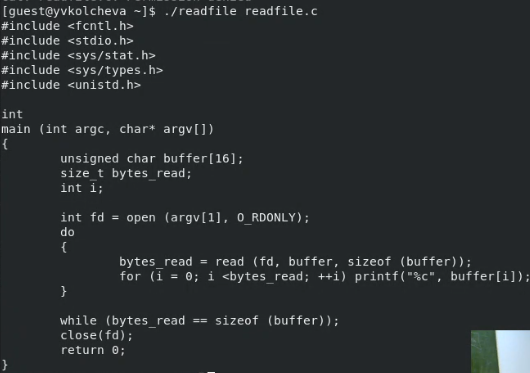{ #fig:017 width=70% }

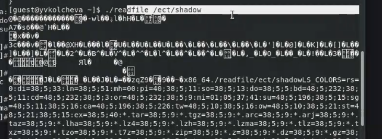{ #fig:018 width=70% }

## Исследование Sticky-бита

1). Выполняя команду ls -l выяснила, что на каталоге /tmp установлен Sticky-бит. Это видно, т.к. в конце написана t. Далее от имени пользователя guest создала файл /tmp/file01.txt. 
После этого просматрела атрибуты только что созданного файла и разрешила всем пользователям право на чтение и запись (рис. [-@fig:019]).

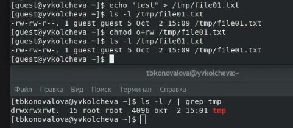{ #fig:019 width=70% }

2). От имени пользователя guest2 прочитала файл file01.txt командой cat. 
Далее успешно дозаписала в конец файла строку "test2", а затем успешно перезаписала содержимое, меняя его на строку "test3". Однако при попытке удалить файл возникла ошибка (рис. [-@fig:020]).

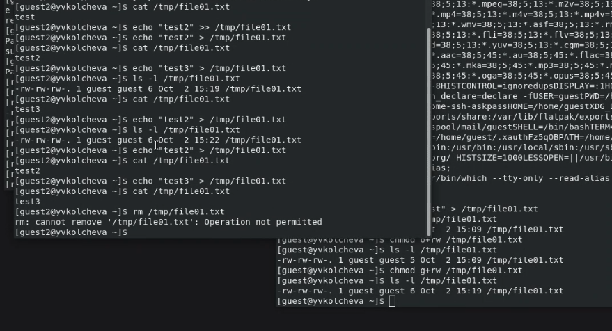{ #fig:020 width=70% }

3). Временно повысела права до суперпользователя и сняла с директории /tmp Sticky-бит. Вышла из режима суперпользователя командой exit (рис. [-@fig:021]).

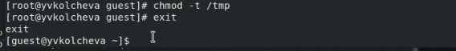{ #fig:021 width=70% }

3). Убедилась с помощью команды ls -l, что Sticky-бит действительно отсутсвует. 
После этого повторила действия от имени пользователя guest2, описанные выше. В этот раз мне удалось удалить файл file01.txt даже при условии, что guest2 не является его владельцем (рис. [-@fig:022]).

{ #fig:022 width=70% }

4). Временно повысела права до суперпользователя и вернула Sticky-бит на каталог /tmp (рис. [-@fig:023]).

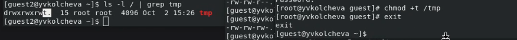{ #fig:023 width=70% }

# Выводы

Изучила механизмы изменения идентификаторов, применения SetUID- и Sticky-битов. Получила практические навыки работы в консоли с дополнительными атрибутами. Рассмотрела работы механизма смены идентификатора процессов пользователей, а также влияние бита Sticky на запись и удаление файлов.

# Библиография

СПИСОК ЛИТЕРАТУРЫ

1.Медведовский И.Д., Семьянов П.В., Платонов В.В. Атака через Internet. — НПО "Мир и семья-95",  1997. — URL: http://bugtraq.ru/library/books/attack1/index.html

2.Теоеретические знания, приведённые в Лабораторной работе №5 - https://esystem.rudn.ru/pluginfile.php/2090129/mod_resource/content/2/005-lab_discret_sticky.pdf

3.Запечников С. В. и др. Информационн~пасность открытых систем. Том 1. — М.: Горячаая линия -Телеком, 2006.

СПИСОК ИНТЕРНЕТ-ИСТОЧНИКОВ

1.[Электронный ресурс] - доступ: https://codeby.school/blog/informacionnaya-bezopasnost/razgranichenie-dostupa-v-linux-znakomstvo-s-astra-linux

2.[Электронный ресурс] - доступ: https://debianinstall.ru/diskretsionnoe-razgranichenie-dostupa-linux/
