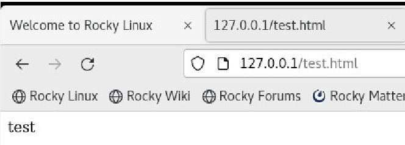

---
## Front matter
lang: ru-RU
title: Презентация по лабораторной работе №6
author: Коновалова Татьяна Борисовна
institute: РУДН, Москва, Россия

date: 9 Октября 2023

## Formatting
toc: false
slide_level: 2
theme: metropolis
header-includes: 
 - \metroset{progressbar=frametitle,sectionpage=progressbar,numbering=fraction}
 - '\makeatletter'
 - '\beamer@ignorenonframefalse'
 - '\makeatother'
aspectratio: 43
section-titles: true
polyglossia-lang: russian
polyglossia-otherlangs: english
mainfont: PT Serif
romanfont: PT Serif
sansfont: PT Sans
monofont: PT Mono
mainfontoptions: Ligatures=TeX
romanfontoptions: Ligatures=TeX
sansfontoptions: Ligatures=TeX,Scale=MatchLowercase
monofontoptions: Scale=MatchLowercase
indent: true
pdf-engine: xelatex
header-includes:
  - \linepenalty=10 # the penalty added to the badness of each line within a paragraph (no associated penalty node) Increasing the value makes tex try to have fewer lines in the paragraph.
  - \interlinepenalty=0 # value of the penalty (node) added after each line of a paragraph.
  - \hyphenpenalty=50 # the penalty for line breaking at an automatically inserted hyphen
  - \exhyphenpenalty=50 # the penalty for line breaking at an explicit hyphen
  - \binoppenalty=700 # the penalty for breaking a line at a binary operator
  - \relpenalty=500 # the penalty for breaking a line at a relation
  - \clubpenalty=150 # extra penalty for breaking after first line of a paragraph
  - \widowpenalty=150 # extra penalty for breaking before last line of a paragraph
  - \displaywidowpenalty=50 # extra penalty for breaking before last line before a display math
  - \brokenpenalty=100 # extra penalty for page breaking after a hyphenated line
  - \predisplaypenalty=10000 # penalty for breaking before a display
  - \postdisplaypenalty=0 # penalty for breaking after a display
  - \floatingpenalty = 20000 # penalty for splitting an insertion (can only be split footnote in standard LaTeX)
  - \raggedbottom # or \flushbottom
  - \usepackage{float} # keep figures where there are in the text
  - \floatplacement{figure}{H} # keep figures where there are in the text
---

# Презентация по лабораторной работы №6

Мандатное разграничение прав в Linux

## Цель лабораторной работы

- Получить практические навыки администрирования
- Ознакомиться с технологией SElinux

## Задачи лабораторной работы

- Найти веб-сервер Apache в списке процессов, определить его контекст безопасности и занести эту информацию в отчёт.
- Посмотреть текущее состояние переключателей SELinux для Apache;
- Изучить справку man httpd_selinux

# Ход лабораторной работы

## Режимы SELunix

С помощью команд getenforce и sestatus убедилась, что SELinux работает в режиме enforcing политики targeted

{ #fig:001 width=70% }

## Веб-сервер Apache

Проверила работу веб-сервера Apache командой sevrice httpd status.

{ #fig:002 width=70% }

## Создание основного файла

Создала файл /var/www/html/test.html от имени суперпользователя

{ #fig:007 width=70% }

## Просмотр файла в веб-браузере

Просморела созданный файл в веб-браузере, открыв ссылку 127.0.0.1/test.html.

{ #fig:008 width=70% }

## Смена контекста

Изменила контекст файла test.html командой chcon.

{ #fig:009 width=70% }

## Отказ в доступе

Перезагрузила страницу в веб-браузере. Теперь я получила ошибку доступа.

{ #fig:010 width=70% }

## Смена порта

В конфигурационном файле поменяла порт, через который происходит прослушивание. Для этого изменила строку "Listen".

{ #fig:012 width=70% }

## Установка порта

Установила порт и посмотрела список доступных можно с помощью команды semanage.

{ #fig:014 width=70% }

## Повторный просмотр в веб-браузере

Просмотрела файл test.html в веб-браузере, открыв ссылку 127.0.0.1:81/test.html.

{ #fig:016 width=70% }

## Выводы

Получила практические навыки адмирирования в OC Linux и ознакомилась с технологией SELinux совместно с веб-сервером Apache.

## Библиография

СПИСОК ЛИТЕРАТУРЫ

1.Медведовский И.Д., Семьянов П.В., Платонов В.В. Атака через Internet. — НПО "Мир и семья-95",  1997. — URL: http://bugtraq.ru/library/books/attack1/index.html

2.Теоеретические знания, приведённые в Лабораторной работе №6 - https://esystem.rudn.ru/pluginfile.php/2090131/mod_resource/content/2/006-lab_selinux.pdf

СПИСОК ИНТЕРНЕТ-ИСТОЧНИКОВ

1.[Электронный ресурс] - доступ: https://codeby.school/blog/informacionnaya-bezopasnost/razgranichenie-dostupa-v-linux-znakomstvo-s-astra-linux

## {.standout}

Спасибо за внимание!
