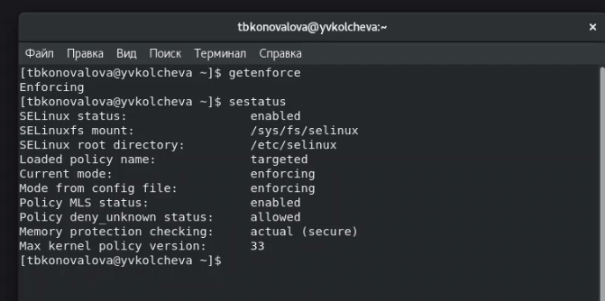

---
# Front matter
lang: ru-RU
title: "Лабораторная работа №6"
subtitle: "Дисциплина: Основы информационной безопасности"
author: "Коновалова Татьяна Борисовна"

# Formatting
toc-title: "Содержание"
toc: true # Table of contents
toc_depth: 2
lof: true # List of figures
lot: true # List of tables
fontsize: 12pt
linestretch: 1.5
papersize: a4paper
documentclass: scrreprt
polyglossia-lang: russian
polyglossia-otherlangs: english
mainfont: PT Serif
romanfont: PT Serif
sansfont: PT Sans
monofont: PT Mono
mainfontoptions: Ligatures=TeX
romanfontoptions: Ligatures=TeX
sansfontoptions: Ligatures=TeX,Scale=MatchLowercase
monofontoptions: Scale=MatchLowercase
indent: true
pdf-engine: xelatex
header-includes:
  - \linepenalty=10 # the penalty added to the badness of each line within a paragraph (no associated penalty node) Increasing the value makes tex try to have fewer lines in the paragraph.
  - \interlinepenalty=0 # value of the penalty (node) added after each line of a paragraph.
  - \hyphenpenalty=50 # the penalty for line breaking at an automatically inserted hyphen
  - \exhyphenpenalty=50 # the penalty for line breaking at an explicit hyphen
  - \binoppenalty=700 # the penalty for breaking a line at a binary operator
  - \relpenalty=500 # the penalty for breaking a line at a relation
  - \clubpenalty=150 # extra penalty for breaking after first line of a paragraph
  - \widowpenalty=150 # extra penalty for breaking before last line of a paragraph
  - \displaywidowpenalty=50 # extra penalty for breaking before last line before a display math
  - \brokenpenalty=100 # extra penalty for page breaking after a hyphenated line
  - \predisplaypenalty=10000 # penalty for breaking before a display
  - \postdisplaypenalty=0 # penalty for breaking after a display
  - \floatingpenalty = 20000 # penalty for splitting an insertion (can only be split footnote in standard LaTeX)
  - \raggedbottom # or \flushbottom
  - \usepackage{float} # keep figures where there are in the text
  - \floatplacement{figure}{H} # keep figures where there are in the text
---

# Цель работы

Цель лабораторной работы --- Получить практические навыки адмирирования в OC Linux и ознакомиться с технологией SELinux совместно с веб-сервером Apache.

# Теоретические данные

SELinux, или Security Enhanced Linux, --- это продвинутый механизм управления доступом, разработанный Агентством национальной безопасности (АНБ) США для предотвращения злонамеренных вторжений. Он реализует мандатную модель управления доступом (MAC --- Mandatory Access control) в дополнение к уже существующей в Linux дискреционной модели (DAC --- Discretionary Access Control), то есть разрешениям на чтение, запись, выполнение.

У SELinux есть три режима работы:

- Enforcing --- ограничение доступа в соответствии с политикой. Запрещено все, что не разрешено в явном виде. Режим по умолчанию.
- Permissive --- ведёт лог действий, нарушающих политику, которые в режиме enforcing были бы запрещены, но не запрещает сами действия.
- Disabled --- полное отключение SELinux.

В основе структуры безопасности SELinux лежат политики. Политика --- это набор правил, определяющих ограничения и права доступа для всего, что есть в системе. Под "всем" в данном случае понимаются пользователи, роли, процессы и файлы. Политика определяет связь этих категорий друг с другом.                                                                     |

Apache --- это свободное программное обеспечение, с помощью которого можно создать веб-сервер. Несмотря на то, что Apache чаще всего называют сервером (более того, его официальное название --- Apache HTTP Server) --- это всё-таки программа, которую устанавливают на сервер, чтобы добиться определённых результатов.

Для чего нужен Apache сервер:

- чтобы открывать динамические PHP-страницы,
- для распределения поступающей на сервер нагрузки,
- для обеспечения отказоустойчивости сервера,
- чтобы потренироваться в настройке сервера и запуске PHP-скриптов.

Apache является кроссплатформенным ПО и поддерживает такие операционные системы, как Linux, BSD, MacOS, Microsoft, BeOS и другие.

# Задание

1.Найти веб-сервер Apache в списке процессов, определить его контекст безопасности и занести эту информацию в отчёт.
2.Посмотреть текущее состояние переключателей SELinux для Apache;
3.Изучить справку man httpd_selinux
4.Определить тип файлов, находящихся в директории /var/www/htm.

# Выполнение лабораторной работы

1.Вошла в систему под своей учетной записью и убедилась, что SELinux работает в режиме enforcing политики targeted с помощью команды getenforce и sestatus (рис. [-@fig:001]).

{ #fig:001 width=70% }

2.Убедилась, что сервер работает с помощью команды service httpd status (рис. [-@fig:002]).

{ #fig:002 width=70% }

3.С помощью команды ps -eZ нашла, что контекст безопасности Apache --- httpd_t (рис. [-@fig:003]).

{ #fig:003 width=70% }

4.Посмотрела текущее состояние переключателей командой sestatus -b httpd (рис. [-@fig:004]).

{ #fig:004 width=70% }

5.Посмотрела статистику по политике командой seinfo. Узнала, что множество пользователей --- 8, ролей --- 14, типов --- 5010 (рис. [-@fig:005]).

{ #fig:005 width=70% }

6.Определила тип файлов и круг пользователей с правой на создание и поддиректорий в директориях /var/www и /var/www/html командой ls -lZ (рис. [-@fig:006]).

{ #fig:006 width=70% }

7.От имени суперпользователя создала файл /var/www/html/test.html (рис. [-@fig:007]).

{ #fig:007 width=70% }

Обратилась к файлу через веб-сервер, введя в браузер адрес "http://127.0.0.1/test.html". Файл был успешно отображен (риc. [-#fig:008]).

{ #fig:008 width=70% }

8.Изучив справку man httpd_selinux, выяснила, что для httpd определены следующие контексты файлов: httpd_sys_content_t, httpd_sys_script_exec_t, httpd_sys_script_ro_t, httpd_sys_script_rw_t, httpd_sys_script_ra_t, httpd_unconfined_script_exec_t.

Контекст моего файла - httpd_sys_content_t (в таком случае содержимое должно быть доступно для всех скриптов httpd и для самого демона). 
Изменила контекст файла на samba_share_t командой “sudo chcon -t samba_share_t /var/www/html/test.html” . 
После этого убедилась, что контекст поменялся (риc. [-#fig:009]).

{ #fig:009 width=70% }

9.При повторной попытке открыть файл через веб-браузер я получила ошибку доступа (рис. [-@fig:010]).

{ #fig:010 width=70% }

10.Убедилась, что файл доступен для чтения всем пользователям командой ls -l. 
Далее посмотрела log-файлы веб-сервера Apache командой tail, где показаны ошибки (рис. [-@fig:011]).

{ #fig:011 width=70% }

11.Устновила веб-сервер Apache на прослушивание TCP-порта 81, изменяя строку Listen в файле /etc/httpd/conf/httpd.conf (рис. [-@fig:012]).

{ #fig:012 width=70% }

12.Перезапустила сервер и увидела данные log-файлов веб-сервера Apache (рис. [-@fig:013]).

{ #fig:013 width=70% }

13.Устновила для веб-сервера Apache порт TCP-81 и проверила его наличие в списке портов командой semanage (рис. [-@fig:014]).

{ #fig:014 width=70% }

14.Вернула файлу test.html контекст httpd_sys_content_t и снова успешно просмотрела страницу в веб-браузере (рис. [-@fig:015]) и (рис. [-@fig:016]).

{ #fig:015 width=70% }

{ #fig:016 width=70% }

17.Вернула в конфигурационный файл прослушивание порта 80 и удалила порт 81 из списка портов (рис. [-@fig:017]).

{ #fig:017 width=70% }

18.Удалила файл test.html (рис. [-@fig:018]).

{ #fig:018 width=70% }

# Выводы

Получила практические навыки адмирирования в OC Linux и ознакомилась с технологией SELinux совместно с веб-сервером Apache.

# Библиография

СПИСОК ЛИТЕРАТУРЫ

1.Медведовский И.Д., Семьянов П.В., Платонов В.В. Атака через Internet. — НПО "Мир и семья-95",  1997. — URL: http://bugtraq.ru/library/books/attack1/index.html

2.Теоеретические знания, приведённые в Лабораторной работе №6 - https://esystem.rudn.ru/pluginfile.php/2090131/mod_resource/content/2/006-lab_selinux.pdf

3.Запечников С. В. и др. Информационн~пасность открытых систем. Том 1. — М.: Горячаая линия -Телеком, 2006.

СПИСОК ИНТЕРНЕТ-ИСТОЧНИКОВ

1.[Электронный ресурс] - доступ: https://codeby.school/blog/informacionnaya-bezopasnost/razgranichenie-dostupa-v-linux-znakomstvo-s-astra-linux

2.[Электронный ресурс] - доступ: https://debianinstall.ru/diskretsionnoe-razgranichenie-dostupa-linux/
