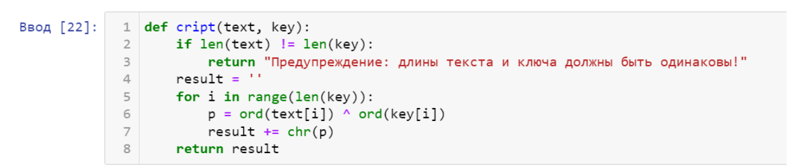
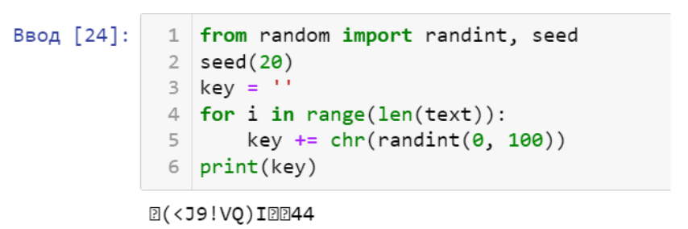
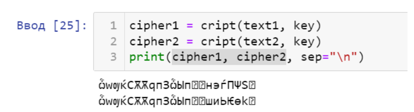
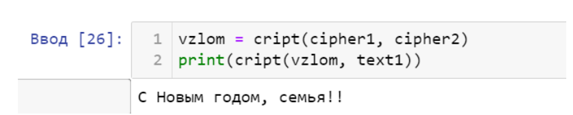
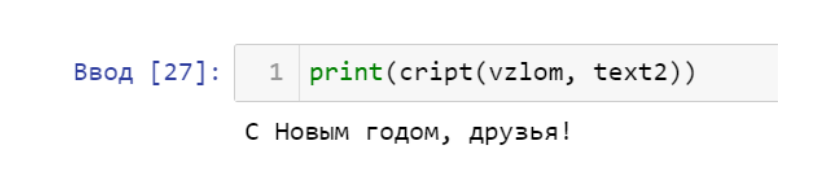
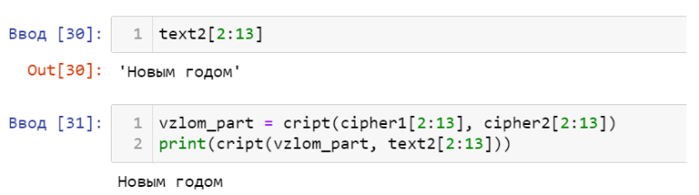

---
# Front matter
lang: ru-RU
title: "Лабораторная работа №8"
subtitle: "Дисциплина: Основы информационной безопасности"
author: "Коновалова Татьяна Борисовна"

# Formatting
toc-title: "Содержание"
toc: true # Table of contents
toc_depth: 2
lof: true # List of figures
lot: true # List of tables
fontsize: 12pt
linestretch: 1.5
papersize: a4paper
documentclass: scrreprt
polyglossia-lang: russian
polyglossia-otherlangs: english
mainfont: PT Serif
romanfont: PT Serif
sansfont: PT Sans
monofont: PT Mono
mainfontoptions: Ligatures=TeX
romanfontoptions: Ligatures=TeX
sansfontoptions: Ligatures=TeX,Scale=MatchLowercase
monofontoptions: Scale=MatchLowercase
indent: true
pdf-engine: xelatex
header-includes:
  - \linepenalty=10 # the penalty added to the badness of each line within a paragraph (no associated penalty node) Increasing the value makes tex try to have fewer lines in the paragraph.
  - \interlinepenalty=0 # value of the penalty (node) added after each line of a paragraph.
  - \hyphenpenalty=50 # the penalty for line breaking at an automatically inserted hyphen
  - \exhyphenpenalty=50 # the penalty for line breaking at an explicit hyphen
  - \binoppenalty=700 # the penalty for breaking a line at a binary operator
  - \relpenalty=500 # the penalty for breaking a line at a relation
  - \clubpenalty=150 # extra penalty for breaking after first line of a paragraph
  - \widowpenalty=150 # extra penalty for breaking before last line of a paragraph
  - \displaywidowpenalty=50 # extra penalty for breaking before last line before a display math
  - \brokenpenalty=100 # extra penalty for page breaking after a hyphenated line
  - \predisplaypenalty=10000 # penalty for breaking before a display
  - \postdisplaypenalty=0 # penalty for breaking after a display
  - \floatingpenalty = 20000 # penalty for splitting an insertion (can only be split footnote in standard LaTeX)
  - \raggedbottom # or \flushbottom
  - \usepackage{float} # keep figures where there are in the text
  - \floatplacement{figure}{H} # keep figures where there are in the text
---

# Цель работы

Цель лабораторной работы --- Освоить на практике применение однократного гаммирования при работе с различными текстами на одном ключе.

# Теоретические данные

Гаммирование представляет собой наложение (снятие) на открытые (зашифрованные) данные последовательности элементов других данных, полученной с помощью некоторого криптографического алгоритма, для получения зашифрованных (открытых) данных. Иными словами, наложение
гаммы — это сложение её элементов с элементами открытого (закрытого)
текста по некоторому фиксированному модулю, значение которого представляет собой известную часть алгоритма шифрования.

В соответствии с теорией криптоанализа, если в методе шифрования используется однократная вероятностная гамма (однократное гаммирование)
той же длины, что и подлежащий сокрытию текст, то текст нельзя раскрыть.
Даже при раскрытии части последовательности гаммы нельзя получить информацию о всём скрываемом тексте.
Наложение гаммы по сути представляет собой выполнение операции
сложения по модулю 2 (XOR) (обозначаемая знаком ⊕) между элементами
гаммы и элементами подлежащего сокрытию текста.

# Задание

1.Не зная ключа и не стремясь его определить, прочитать оба исходных текста;
2.Разработать приложение, позволяющее шифровать и дешифровать тексты в режиме однократного гаммирования;
3.Определить и выразить аналитически способ, при котором злоумышленник может прочитать оба текста, не зная ключа и не стремясь его определить.

# Выполнение лабораторной работы

Лабораторную работу выполнила на языке Pythin 3 в среде Jupiter Notebook.

1.Cоздала функцию, которая осуществляет однократное гаммирование посредством побитового XOR (рис. [-@fig:001]).

{ #fig:001 width=70% }

2.Задала две равные по длине текстовые строки и создала случайный символьный ключ такой же длины (рис. [-@fig:002]) и (рис. [-@fig:003]).

{ #fig:002 width=70% }

{ #fig:003 width=70% }

3.Осуществила шифрование двух текстов по ключу с помощью написанной функции (рис. [-@fig:004])

{ #fig:004 width=70% }

4.Создала переменную, которая, прогнав два шифрованных текста через побитовый XOR, поможет злоумышленнику получить один текст, зная другой, без ключа (рис. [-@fig:005]) и (рис. [-@fig:006]).

{ #fig:005 width=70% }

{ #fig:006 width=70% }

5.Таким же способом я получила часть данных из исходных предложений (рис. [-@fig:007])

{ #fig:007 width=70% }

# Выводы

Освоила на практике применение однократного гаммирования при работе с различными текстами на одном ключе.

# Библиография

СПИСОК ЛИТЕРАТУРЫ

1.Медведовский И.Д., Семьянов П.В., Платонов В.В. Атака через Internet. — НПО "Мир и семья-95",  1997. — URL: http://bugtraq.ru/library/books/attack1/index.html

2.Теоретические знания, приведённые в Лабораторной работе №8 - https://esystem.rudn.ru/pluginfile.php/2090135/mod_resource/content/2/008-lab_crypto-key.pdf

3.Запечников С. В. и др. Информационн~пасность открытых систем. Том 1. — М.: Горячаая линия -Телеком, 2006.

СПИСОК ИНТЕРНЕТ-ИСТОЧНИКОВ

1.[Электронный ресурс] - доступ: https://codeby.school/blog/informacionnaya-bezopasnost/razgranichenie-dostupa-v-linux-znakomstvo-s-astra-linux

2.[Электронный ресурс] - доступ: https://debianinstall.ru/diskretsionnoe-razgranichenie-dostupa-linux/
